## Custom Project Template for SageMaker with GitHub and Jenkins


This repository contains an example custom SageMaker Project template with details on what the template achieves and how to set it up. You can follow the instructions below to manually set up and run the project. (Note that the instructions and steps are adopted and updated from the AWS blog posts [Create Amazon SageMaker projects using third-party source control and Jenkins](https://aws.amazon.com/blogs/machine-learning/create-amazon-sagemaker-projects-using-third-party-source-control-and-jenkins/) and [Build Custom SageMaker Project Templates – Best Practices](https://aws.amazon.com/blogs/machine-learning/build-custom-sagemaker-project-templates-best-practices/), please refer to the original resources for more information).

## Architecture
In the following sections, we cover the one-time setup tasks and the steps required when building new pipelines using the custom SageMaker MLOps project templates to build out the following high-level architecture (click on image to expand).

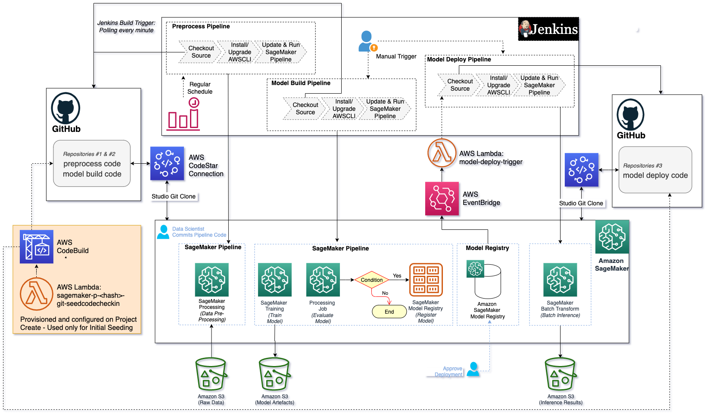

The data preprocess and model build pipelines are triggered based on changes to the model build GitHub repository based on Jenkins polling the source repository every minute. The model deploy pipeline can be triggered based on changes to the model deploy code in GitHub or when a new model version is approved in the SageMaker Model Registry.


## Prerequisites
The following are prerequisites to completing the steps in this post:

- Jenkins (we use Jenkins v2.3) installed with administrative privileges. (instuctions will be given later to guide you to create a Jenkins server on Amazon EC2)
- A GitHub user account.
- Three GitHub repositories initialized with a README. You must create these repositories as a prerequisite because you supply the three repositories as input when creating your SageMaker project. You can choose the repository names and below are just example repository names. The repositories are used for the preprocess, build, and deploy pipelines. The project templates automatically seed the code that is pushed to these repositories:
  - NYCTaxi-mlops-preprocess - Seeded with your model data preparation and SageMaker Pipeline code.
  - NYCTaxi-mlops-build – Seeded with your model build code, which includes the code needed for model training, model evaluation, and your SageMaker pipeline code.
  - NYCTaxi-mlops-build – Seeded with your model deploy code, which includes the code needed to create the batch transform pipeline.
  - An AWS account and access to services used in this example.
  
We also assume some familiarity with Jenkins. For general information on Jenkins, we recommend reading the [Jenkins Handbook](https://www.jenkins.io/doc/book/).


The one-time setup tasks include:

1. Establish the [AWS CodeStar](https://aws.amazon.com/codestar/) connection from your AWS account to your GitHub user or organization.
2. Install dependencies on your Jenkins server.
3. Set up permissions for communication between Jenkins and AWS.
4. Create an [Amazon EventBridge rule](https://aws.amazon.com/eventbridge/) and [AWS Lambda function](http://aws.amazon.com/lambda) that is triggered to run the Jenkins model deploy pipeline when approved models are registered in the model registry.

Please find detailed instructions below for each of the one-time setup steps:
## One-time setup tasks
The tasks in this section are required as part of the one-time setup activities that must be performed for each AWS Region (in this example we use us-east-1 region) where you use the new SageMaker MLOps project templates. The steps to create a GitHub connection and an [AWS Identity and Access Management](http://aws.amazon.com/iam) (IAM) user for Jenkins could be incorporated into a CloudFormation template for repeatability. For this repo example, we explicitly define the steps.

### 1. Set up the GitHub connection
In this step, you connect to your GitHub repositories using AWS Developer Tools and, more specifically, [AWS CodeStar connections](https://docs.aws.amazon.com/dtconsole/latest/userguide/welcome-connections.html). The SageMaker project uses this connection to connect to your source code repositories. Please refer to the [blog post](https://aws.amazon.com/blogs/machine-learning/create-amazon-sagemaker-projects-using-third-party-source-control-and-jenkins/) section **```Set up the GitHub connection```** to finish the codestar connection setup.

### 2. Install Jenkins software dependencies
In this step, you ensure that several software dependencies are in place on the Jenkins server. If you don’t have an existing Jenkins server or need to create one for testing, you can [install Jenkins](https://www.jenkins.io/doc/book/installing/).

If you would like to run the Jenkins server on a AWS EC2 instance, you can follow the instructions about [Jenkins on AWS](https://www.jenkins.io/doc/tutorials/tutorial-for-installing-jenkins-on-AWS/) to set up your Jenkins server and make sure your instance has a public DNS name.

A few of the software dependencies needs to be installed.
- pip3
- [Install Git](https://github.com/git-guides/install-git) on the Jenkins server if it is not already installed
- [Install the following plugins](https://www.jenkins.io/doc/book/managing/plugins/) on your Jenkins server:
  - [Job DSL](https://plugins.jenkins.io/job-dsl)
  - [Pipeline](https://plugins.jenkins.io/workflow-aggregator)
  - [Pipeline: AWS Steps](https://plugins.jenkins.io/pipeline-aws)
  - [CloudBees AWS Credentials for the Jenkins plugin](https://plugins.jenkins.io/aws-credentials/) 

### 3. Create a Jenkins user on IAM

In this step, you create an IAM user and permissions policy that allows for programmatic access to Amazon S3, SageMaker, and AWS CloudFormation. This IAM user is used by your Jenkins server to access the AWS resources needed to configure the integration with SageMaker projects and your Jenkins server. After this user is created, you configure the same on the Jenkins server using the IAM user credentials.

For detailed policy information and creation steps, please refer to the section **```Create a Jenkins user on IAM```** and **```Configure the Jenkins IAM user on the Jenkins server```** in the [blog post](https://aws.amazon.com/blogs/machine-learning/create-amazon-sagemaker-projects-using-third-party-source-control-and-jenkins/). Note that you need to replace the ```${AWS::Region}``` and ```${AWS::AccountId}``` with the region and account ID that you will use.

### 4. Create a model deployment Jenkins pipeline trigger
In this step, you configure the trigger to run your Jenkins model deployment pipeline whenever a new model version gets registered into a model package group in the SageMaker Model Registry. To do this, you create an API token for communication with your Jenkins server. Then you run a CloudFormation template from your AWS account that sets up a new rule in EventBridge to monitor the [approval status of a model package](https://docs.aws.amazon.com/sagemaker/latest/dg/model-registry-approve.html) registered in the SageMaker Model Registry. We use the model registry to catalog models and metadata about those models, as well as manage the approval status and model deployment pipelines. The CloudFormation template also creates a Lambda function that is the event target when a new model gets registered. This function gets the Jenkins API user token credentials from [AWS Secrets Manager](https://aws.amazon.com/secrets-manager/) and uses that to trigger the pipeline remotely based on the trigger.

You can use the same model trigger created in the [blog post](https://aws.amazon.com/blogs/machine-learning/create-amazon-sagemaker-projects-using-third-party-source-control-and-jenkins/) and follow the instructions there. In this repo, you can use the **create-model-trigger.yml** CloudFormation template under the **"cloud_formation"** folder to create the necessary resources or click on the link below to launch the stack. 

[](https://us-east-1.console.aws.amazon.com/cloudformation/home?region=us-east-1#/stacks/quickcreate?templateURL=https://sagemaker-sample-files.s3.amazonaws.com/templates/create-model-trigger.yml&stackName=SageMakerJenkins)

Note that, the CloudFormation Stack requires three parameters as input:
- JenkinsUser – Your Jenkins user with administrative privileges (for example, Admin)
- JenkinsAPIToken – The Jenkins API token you created (You can follow the [blog post](https://aws.amazon.com/blogs/machine-learning/create-amazon-sagemaker-projects-using-third-party-source-control-and-jenkins/) instruction to get the API Token from your Jenkins server. for example, 11cnnnnnnnnnnnnnn)
- JenkinsURL– The URL of your Jenkins server (for example, http://ec2-nn-nn-nnn-n.us-east-1.compute.amazonaws.com)


This completes the one-time setup required to use the new MLOps SageMaker project templates for each Region. Depending on your organizational structure and roles across the ML development lifecycle, these one-time setup steps may need to be performed by your DevOps, MLOps, or system administrators.

We now move on to the steps for creating SageMaker projects using the custom MLOps project template from SageMaker Studio.


## Purpose
The purpose of this template is to demonstrate how to create custom project template to use github and Jenkins as the resources. You can always update and create your own custom project template based on your environment setup and workflow requirements. There are other AWS samples available to show you how to create custom template and some useful MLOps architectures, such as [Amazon SageMaker MLOps with Featurestore and DataWrangler Using CDK](https://github.com/aws-samples/amazon-sagemaker-mlops-with-featurestore-and-datawrangler) and [Amazon SageMaker Drift Detection](https://github.com/aws-samples/amazon-sagemaker-drift-detection). These examples uses CDK to generate the CFN templates. For instructions on how to install CDK, check the relevant [documentation](https://docs.aws.amazon.com/cdk/latest/guide/getting_started.html#getting_started_install). In this example, we will show you how to create the SageMaker custom project template step by step. You can also refer to the github sample: [Custom Project Templates in SageMaker](https://github.com/aws-samples/sagemaker-custom-project-templates) for more example Project teamplats.

## Adding the template to Amazon SageMaker Projects in Studio
### Step 1. Create Portfolio in [AWS Service Catalog](https://docs.aws.amazon.com/servicecatalog/latest/dg/what-is-service-catalog.html)


### Step 2. Create a new product for the portfolio
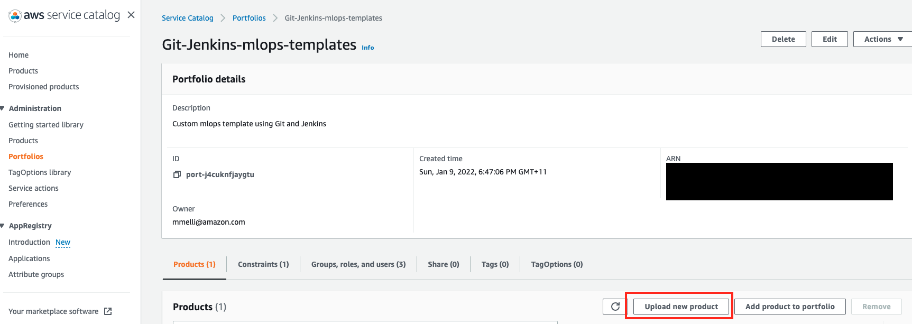
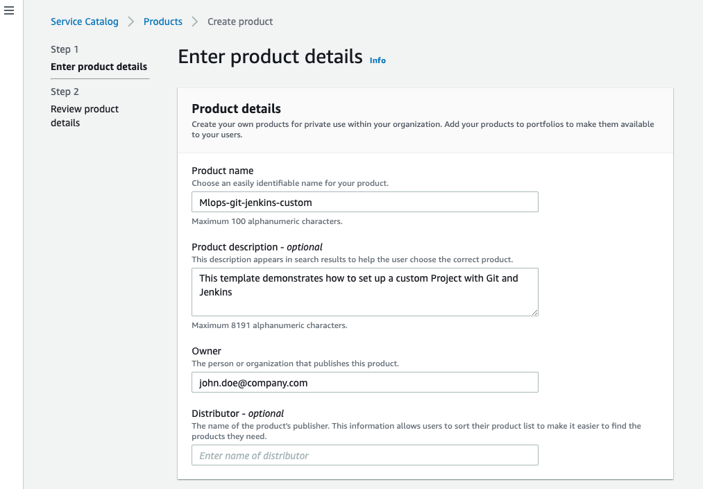

Note here, you need to upload the AWS CloudFormation template **"jenkins-git-template-custom-v1.yml**. You can upload the template file from Amazon S3 console or using AWS CLI. Or you can run the shell script to create the s3 bucket and upload the yaml file.
```
./deploy.sh
```
The Amazon S3 template URL should have a format like:
```https://cloud-formation-<ACCOUNT-ID>-<REGION>.s3.amazonaws.com/jenkins-git-template-custom-v1.yml```

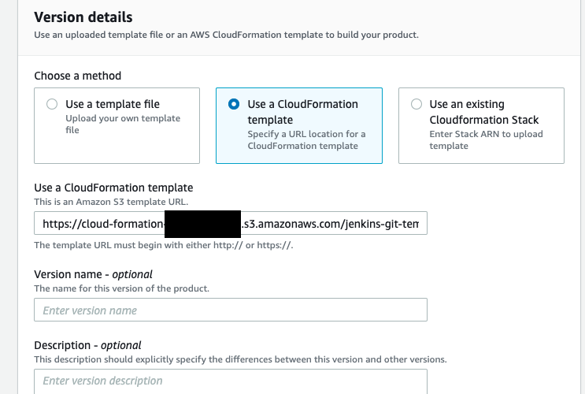

### Step 3. Add SageMaker visibility tag to the product
Tag **sagemaker:studio-visibility** with value **true**.

Note that this is the tag of the Products, not the Portfolios.

### Step 4. Go to the Portfolio created and add a constraint.
We use the default AmazonSageMakerServiceCatalogProductsLaunchRole in this example. You can create custom Role that meets your organisations requirements.
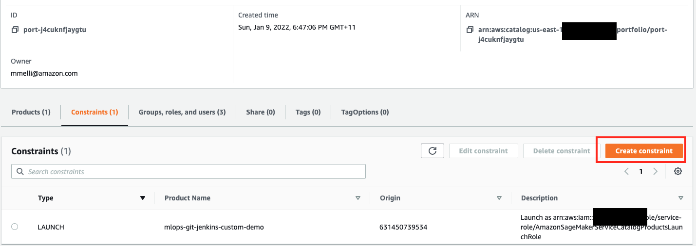

### Step 5. Go to the Portfolio created and share it with the relevant users as well as the SageMaker execution role, used by SageMaker Studio.


### Step 6. The template becomes available in SageMaker Studio
Go to SageMaker Studio console, under Project, you can choose to create project and the custom project template will be available under **```Organization templates```** as shown below.

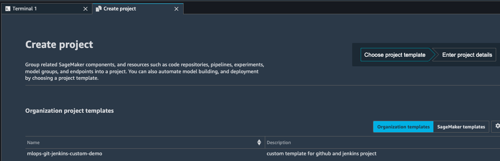

## Use the Custom MLOps project template with GitHub and Jenkins
In this section, we cover how to use this custom MLOps project templates that allow you to utilize Jenkins as your orchestrator. First, we create a new SageMaker project using the new template. Then we use the generated Jenkins pipeline code to create the Jenkins pipeline.

### Step 1. Select the template in the example above and provide a name.

Note that the name may have a maximum of 32 characters.

- Under **ModelPreprocess CodeRepository Info**, provide the following parameters:
For **URL**, enter the URL of your existing Git repository (e.g. ```NYCTaxi-mlops-preprocess``` mentioned in the prerequisites) for the model build code in https:// format.
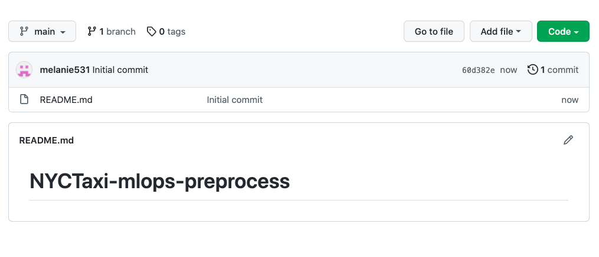
- For **Branch**, enter the branch to use from your existing Git repository for pipeline activities as well as for seeding code (if that option is enabled).
- - For **Full Repository Name**, enter the Git repository name in the format of <username>/<repository name> or <organization>/<repository name>.
- For **Codestar Connection ARN**, enter the ARN of the AWS CodeStar connection created as part of the one-time setup steps.
- For **Sample Code**, enable this option to allow the seed code be populated in the repository identified.

The seed code includes model build code for the NYCTaxi fare prediction use case that is used in this repository; when this is enabled, a new /jenkins folder with Jenkins pipeline code is also seeded.

It’s recommended to allow SageMaker projects to seed your repositories with the code to ensure proper structure and for automatic generation of the Jenkins DSL pipeline code. If you don’t choose this option, you need to create your own Jenkins DSL pipeline code. You can then modify the seed code specific to your model based on your use case.

Similarly, fill in all the information for **ModelBuild CodeRepository Info** and **ModelDeploy CodeRepository Info**

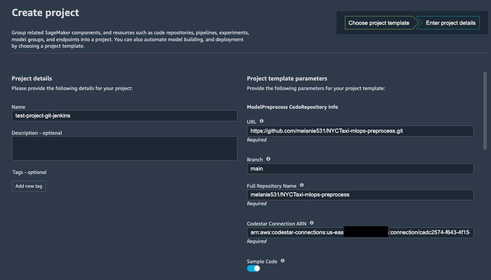

### Step 2. Wait for the project to be created.
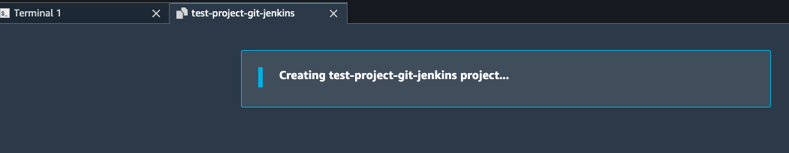
You can also check from the CloudFormation console to see the stack creation progress.
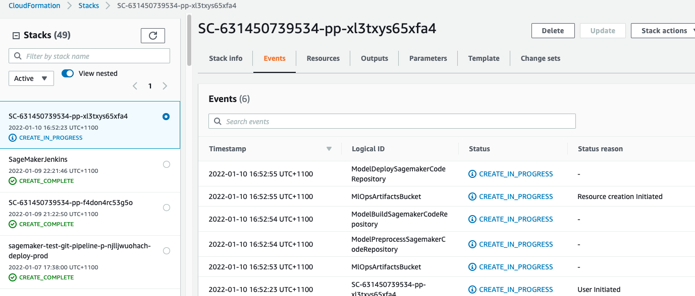

If there is any issue or error occured during the project creation step, please read the logs in the CloufFormation Stack and also go to CodeBuild history to check the CodeBuild logs.
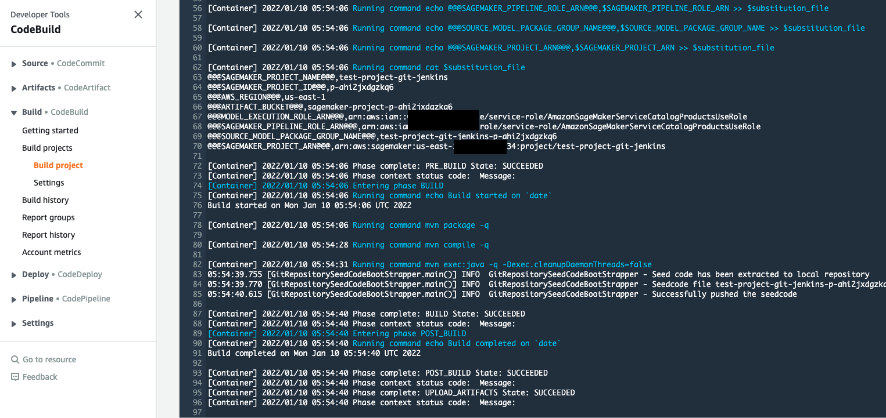

When the project is complete, you receive a successful message, and your project is now listed on the **Projects** list.
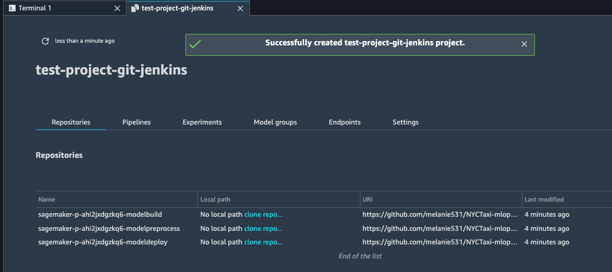

You can clone the reposority by clicking on the link under **Local path** to make a copy of the code available in your studio local path.

You now have seed code in your NYCTaxi-mlops-preprocess, NYCTaxi-mlops-build and NYCTaxi-mlops-pdeploy GitHub repositories. You also have the /jenkins folders containing the Jenkins DSL to create your Jenkins pipeline.

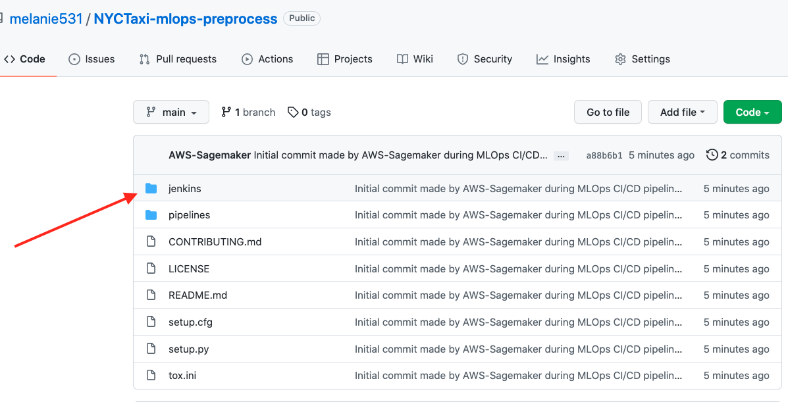

To learn more about the Jenkinsfile and seed_job.groovy, please refer to the [blog post](https://aws.amazon.com/blogs/machine-learning/create-amazon-sagemaker-projects-using-third-party-source-control-and-jenkins/) in section **```Automatically generated Jenkins pipeline syntax```**.

## Create a Jenkins model build pipeline
In this step, we create the Jenkins pipeline using the DSL generated in the seed code created through the SageMaker project in the previous step.

Please refer to the section **```Create a Jenkins model build pipeline```** in the [blog post](https://aws.amazon.com/blogs/machine-learning/create-amazon-sagemaker-projects-using-third-party-source-control-and-jenkins/) to get the step by step instructions of creating the Jenkins pipelins for data preprocessing, model building and batch transform.


## Security

See [CONTRIBUTING](CONTRIBUTING.md#security-issue-notifications) for more information.

## License

This library is licensed under the MIT-0 License. See the LICENSE file.

